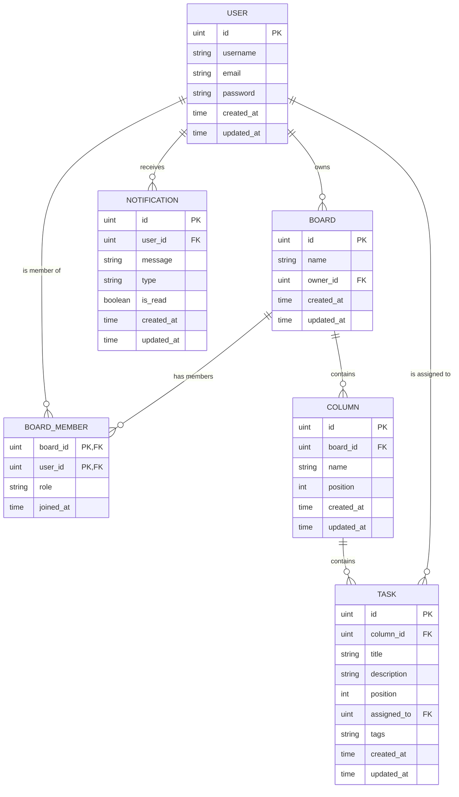

### Relationships:
1. **User & Board (Owner)**:1:N
2.  **User & Board (Membership)**:Many-to-Many
3.  **Board & Column**: 1:N
4.  **Column & Task**: 1:N
5.  **User & Task**:1:N
6.  **User & Notification**:1:N
