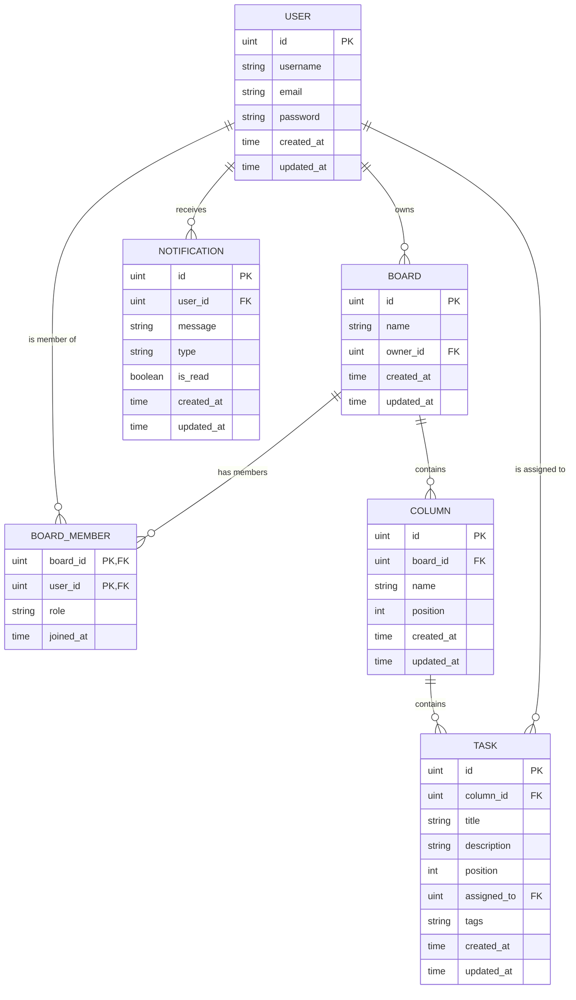

# Kanban Board
- Website : https://kanban-board-ten-beta-21.vercel.app
## ER Diagram 

### Relationships:
1. **User & Board (Owner)**:1:N
2.  **User & Board (Membership)**:Many-to-Many
3.  **Board & Column**: 1:N
4.  **Column & Task**: 1:N
5.  **User & Task**:1:N
6.  **User & Notification**:1:N

##  Auth Service

### 1. Register 

- **Method:** `POST`
- **URL:** `/api/auth/register` 
- **Request Body:**

```json
{
  "username": "test",
  "email": "test@example.com",
  "password": "test1234"
}
```

- **Response (201 Created):**
```json
{
  "id": 1,
  "username": "test",
  "email": "test@example.com"
}
```

### 2. Login 

- **Method:** `POST`
- **URL:** `/api/auth/login`
- **Request Body:**

```json
{
  "username": "test",
  "password": "test1234"
}
```

- **Response (200 OK):**

```json
{
  "token": "sdffdgdfvfsvsdf",
  "user": {
    "id": 1,
    "username": "test"
  }
}
```

---

##  Kanban Service

**Send Header:** `Authorization: Bearer <token>`

### 1. Boards

#### 1.1 List Boards

- **Method:** `GET`
- **URL:** `/api/kanban/boards`

#### 1.2 Create Board 

- **Method:** `POST`
- **URL:** `/api/kanban/boards`
- **Request Body:** `{"name": "Test1"}`

#### 1.3 Board Details

- **Method:** `GET`
- **URL:** `/api/kanban/boards/:id`

#### 1.4 Invite Member

- **Method:** `POST`
- **URL:** `/api/kanban/boards/:id/invite`
- **Request Body:** `{"email": "friend@example.com"}`

---

### 2. Columns

#### 2.1 Create Column

- **Method:** `POST`
- **URL:** `/api/kanban/boards/:id/columns`
- **Request Body:** `{"name": "To Do", "position": 0}`

#### 2.2 Update Column

- **Method:** `PATCH`
- **URL:** `/api/kanban/columns/:id`
- **Request Body:** `{"name": "New Name"}`

#### 2.3 Delete Column

- **Method:** `DELETE`
- **URL:** `/api/kanban/columns/:id`

---

### 3. Tasks

#### 3.1 Create Task

- **Method:** `POST`
- **URL:** `/api/kanban/columns/:id/tasks`
- **Request Body:**

```json
{
  "title": "Task1",
  "description": "Description",
  "position": 0
}
```

#### 3.2 Update Task

- **Method:** `PATCH`
- **URL:** `/api/kanban/tasks/:id`
- **Request Body:** `{"title": "Updated Title", "description": "..."}`

#### 3.3 Move Task

- **Method:** `PATCH`
- **URL:** `/api/kanban/tasks/:id/move`
- **Request Body:**

```json
{
  "target_column_id": 2,
  "position": 1
}
```

---

### 4. Notifications

#### 4.1 List Notifications

- **Method:** `GET`
- **URL:** `/api/kanban/notifications`

#### 4.2 Mark as Read

- **Method:** `PATCH`
- **URL:** `/api/kanban/notifications/:id/read`

## Technology used to improve performance
### 1.Backend: Go & Gin Framework 
- High Performance Concurrency `รองรับผู้ใช้ได้เยอะ`
- Compiled Language `เร็วและใช้ Ram น้อย`
- Gin Gonic `เร็วและ memory footprint น้อย`
## 2.Frontend: Vite & React
- Fast Build & Bundle `โหลดหน้าเว็บและสร้าง file production เร็ว`
- Virtual DOM `update ui โดยไม่ต้อง refresh ใหม่ทั้งหน้า`
## 3.Database: PostgreSQL & GORM Optimization
- Indexing `query big data ได้ไว`
- Eager Loading `preload ลด latency`
## 4.Infrastructure: Nginx & Docker
- Reverse Proxy Gateway `ลด connection pooling`
- Microservices Architecture `แยก auth กับ kanban scale เฉพาะส่วนได้ดีขึ้น`
## 5.Deployment: Vercel & Render
- Vercel `deploy frontend`
- Render `deploy backend`

##### **ทั้งนี้บางภาษาและเครื่องมือผมยังไม่ได้ศึกษาให้ลึกมากพอและมีอีกหลายอย่างที่ยังจำเป็นจะต้องเรียนรู้**
